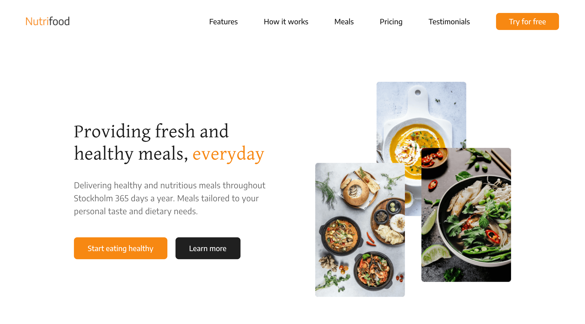

# Nutrifood

Nutrifood is a food delivery service that offers meal subscriptions for busy people with a wide range of healthy and nutritious meals that are tailored by expert chefs to suit different dietary needs and lifestyles, and are delivered throughout Stockholm.

## Table of contents

- [Overview](#overview)
  - [The challenge](#the-challenge)
  - [Screenshot](#screenshot)
  - [Links](#links)
- [Process](#process)
  - [Built with](#built-with)
  - [What I learned](#what-i-learned)
  - [Continued development](#continued-development)
  - [Useful resources](#useful-resources)
- [Author](#author)
- [Acknowledgments](#acknowledgments)

## Overview

### The challenge

Users should be able to:

- View the optimal layout depending on their device's screen size
- Navigate the page via a navigation menu
- See hover and focus states for interactive elements

### Screenshot

### Links

- Solution URL: [https://github.com/jeanpierretouma/nutrifood](https://github.com/jeanpierretouma/nutrifood)
- Live Site URL: [https://jeanpierretouma.github.io/nutrifood](https://jeanpierretouma.github.io/nutrifood)

## Process

### Built with

- Semantic HTML5 markup
- CSS custom properties
- Flexbox
- CSS Grid
- JavaScript
- jQuery

### What I learned

I learned how to make a sticky navigation bar and a mobile navigation bar with vanilla JavaScript by using JavaScript to toggle on and off classes in CSS to apply the stylings once the conditions are met.

### Continued development

This project is complete in terms of functionality and looks but it needs some animation effects which will be implemented later.

Another feature that I'll implement in this project is JS form validation to increase the security and interaction of the contact form of the landing page.

### Useful resources

- [Sticky Navigation Bar On Scroll Using Vanilla Javascript | Fixed Navbar on Scroll](https://www.youtube.com/watch?v=6HFpw5fcaD8) - This video helped me with building a sticky navigation bar by using a few lines of vanilla JavaScript.
- [How TO - Smooth Scroll](https://www.w3schools.com/howto/howto_css_smooth_scroll.asp) - This article provides a cross-browser solution for smooth scrolling by using jQuery.

## Author

- Website - [Jean-Pierre Touma](https://github.com/jeanpierretouma)

## Acknowledgments

Nutrifood website is inspired by [Omnifood](https://omnifood.dev/) which is a restaurant website made to be the product of the [Build Responsive Real-World Websites with HTML and CSS](https://www.udemy.com/course/design-and-develop-a-killer-website-with-html5-and-css3/) created by Jonas Schmedtmann.